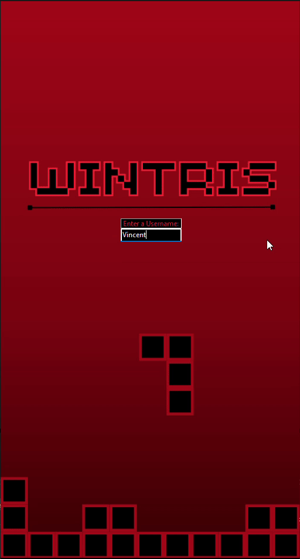
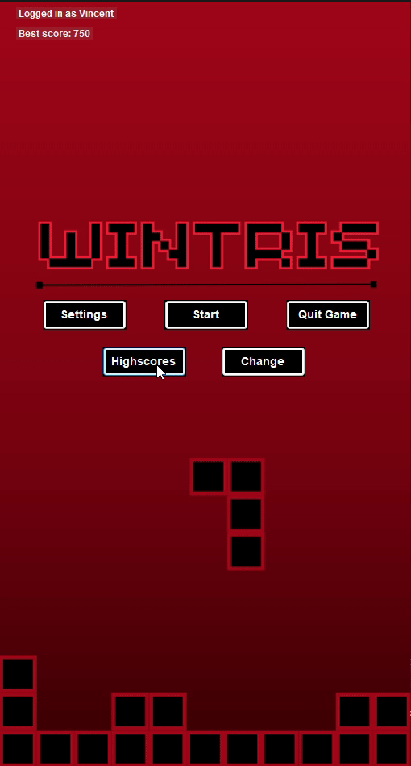
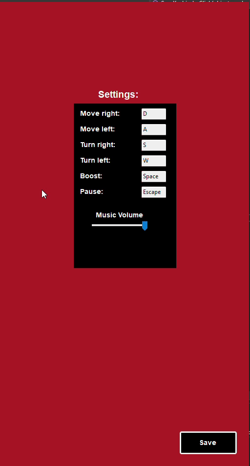
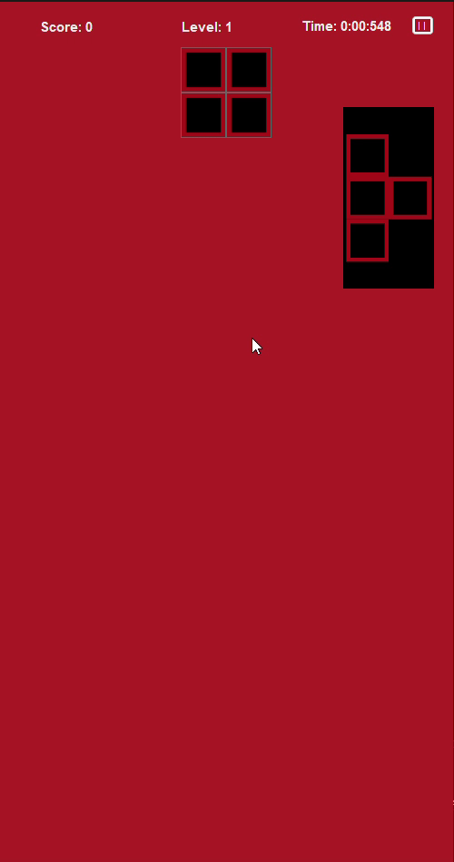

# Lernperiode 5

**Zeitraum:** 2. Mai bis 23. Mai

---

## Grobplanung

Ich habe geplant, mein Tetris-Spiel um folgende Funktionen zu erweitern:

- Eingabe von Spielernamen  
- Speicherung der erreichten Punktzahlen  
- Bestenliste mit den 10 höchsten Scores  

---

## 2. Mai

- [x] Textbox zur Eingabe eines Benutzernamens hinzufügen  
- [x] Button zum Anzeigen der Bestenliste hinzufügen  
- [x] Erstellung einer Datenbank für das Spiel  
- [x] Implementierung der Datenspeicherung  

Heute habe ich eine Textbox eingebaut, die beim Start des Spiels angezeigt wird und die Eingabe eines Benutzernamens ermöglicht. Ausserdem habe ich sichergestellt, dass solange das Spiel nicht neu gestartet wird, immer der gleiche Benutzername verwendet wird. Anschliessend fügte ich einen Button hinzu, der zukünftig zum Anzeigen der Bestenliste dienen soll (Code hierfür wurde noch nicht implementiert). 

Für die Speicherung der Daten erstellte ich eine SQL-Datenbank namens `Wintris_Data` mit drei Tabellen: `scores`, `usernames` und der Zwischentabelle `username2score`, da eine n:m-Beziehung vorliegt. Zur Datenbank-Anbindung installierte ich das NuGet-Paket `System.Data.SqlClient`. Beim Programmieren habe ich versucht, diesmal konsequent das DRY-Prinzip einzuhalten.

---

## 9. Mai – Kernfunktionalität

- [x] Bugfixes bei fehlerhafter Datenspeicherung  
- [x] Implementierung einer funktionierenden Bestenliste (Anzeige der 10 besten Ergebnisse)  
- [x] Hinzufügen eines Einstellungsmenüs (Settings)  

Ich habe zuerst Fehler bei der Datenspeicherung behoben: Statt einem neuen Eintrag wurden fälschlicherweise 34 Einträge erzeugt. Nach der Fehlerbehebung begann ich mit der Erstellung der Highscore-Liste, die alle Punktzahlen aller Spieler anzeigt.

Dazu erstellte ich ein neues Formular `Highscores` mit einer `ListView` zur Anzeige der Einträge. Die Daten werden per SQL-Abfrage geladen:

```sql
SELECT u.username, s.score
FROM username u
INNER JOIN username2score us ON u.usernameID = us.usernameID
INNER JOIN score s ON us.scoreID = s.scoreID
ORDER BY s.score DESC;
```

Ausserdem begann ich mit der Implementierung eines Einstellungsmenüs, in dem grundlegende Einstellungen wie Tastenbelegung (Key-Binds) und Musiklautstärke geändert werden können.

---

## 16. Mai – Kernfunktionalität und Ausbau

- [x] Settings-Menü fertigstellen  
- [ ] Blockanzeige (Vorschau des nächsten Blocks) implementieren  
- [ ] Alten Code bereinigen (DRY-Prinzip)  
- [ ] Weitere Sounds ins Spiel einfügen (optional)  

Ich arbeitete vor allem am Settings-Menü. Die zuvor genutzten *ComboBoxen* ersetzte ich durch `TextBox`-Elemente, um eine direktere Eingabemöglichkeit für die Key-Binds zu schaffen. Zusätzlich implementierte ich eine Funktion, die es ermöglicht, Key-Binds dynamisch zu ändern: Nach einem Klick auf eine `TextBox` wartet das Programm auf die nächste Tasteneingabe und aktualisiert den Key-Bind automatisch.

Für die Lautstärkeregelung der Hintergrundmusik fügte ich eine `TrackBar` hinzu. Die Lautstärke kann darüber stufenlos eingestellt werden. Dafür erweiterte ich meinen `MusicPlayer` um die Funktion `SetVolume(float volume)`.

Leider trat ein Problem auf: Die Wiedergabe der Musik funktionierte nicht zuverlässig, teilweise wurde sie nicht abgespielt oder das Looping funktionierte nicht wie erwartet. Deshalb plane ich, mich nächste Woche vor allem mit der Fehlerbehebung zu beschäftigen.

---

## 23. Mai – Abschluss

- [x] Bugfixes (MusicPlayer und weitere kleinere Fehler)  
- [x] Blockanzeige implementieren (falls Zeit reicht)  
- [x] Reflexion und Projektbeschreibung verfassen  

Ich arbeitete weiter an der Behebung des MusicPlayer-Problems. Nach mehreren Anpassungen der Methode `PlayMusic()` ohne Erfolg stellte ich fest, dass die Musik im Hauptmenü zwar funktionierte, die Ingame-Musik aber nur kurz spielte und dann stoppte.

Ich entschied mich, meine Zeit besser zu nutzen und kleinere Bugs zu beheben. Dabei bemerkte ich, dass die O-Form im Spiel nie erschien. Ursache war, dass sie nicht im `shapeRotations`-Dictionary eingetragen war. Nach Ergänzung funktionierte die O-Form wie erwartet.

Anschliessend implementierte ich die Vorschauanzeige des nächsten Blocks (bekannt aus klassischem Tetris). Ich erstellte für jede Blockform in Canva ein schwarzes Rechteck mit der jeweiligen Form, exportierte diese als PNG-Dateien und fügte sie als `PictureBox` mit `SizeMode = StretchImage` ein.

Im Code wird nun zwischen `CurrentShape` und `NextShape` unterschieden. Über einen `switch`-Block wird die passende `PictureBox` angezeigt, die den nächsten Block visualisiert.

---

## Fertiges Projekt

Mein Tetris-Spiel wurde deutlich erweitert und bietet nun zahlreiche Funktionen, die das Spielerlebnis nachhaltig verbessern.

Bereits beim Start des Spiels kann der Spieler seinen Namen eingeben. Dadurch wird jede Partie personalisiert und die erreichten Punktzahlen können eindeutig einem Nutzer zugeordnet werden. Die Ergebnisse werden in einer eigens erstellten SQL-Datenbank gespeichert, sodass alle Highscores dauerhaft erhalten bleiben – auch nach dem Schliessen des Spiels.

Über einen Button lässt sich eine Bestenliste öffnen, die automatisch die zehn besten Ergebnisse aller Spieler anzeigt. Dies fördert den Wettbewerbsgeist und ermöglicht es, die eigenen Fortschritte stets im Blick zu behalten.

Zusätzlich wurde ein Einstellungsmenü integriert, in dem grundlegende Anpassungen vorgenommen werden können. So ist es möglich, die Tastenbelegung (Key-Binds) individuell zu konfigurieren und die Lautstaerke der Hintergrundmusik nach Wunsch anzupassen. Diese Flexibilität trägt zu einer angenehmeren und benutzerfreundlicheren Spielumgebung bei.

Ein weiteres praktisches Feature ist die Vorschau des nächsten Blocks, wie sie aus klassischen Tetris-Versionen bekannt ist. Dadurch kann der Spieler besser planen und sein Spiel strategischer gestalten.

Das grundlegende Gameplay orientiert sich weiterhin am klassischen Tetris-Prinzip. Durch die neuen Funktionen wirkt das Spiel jedoch moderner und komfortabler. Die Benutzeroberfläche ist übersichtlich und intuitiv gestaltet, sodass sich Spieler schnell zurechtfinden. Die Hintergrundmusik sorgt zusätzlich für eine angenehme Atmosphäre und erhöht den Spielspass.

---

## Gameplay/Screenshots

### Startbildschirm mit Namenseingabe


### Bestenliste


### Einstellungsmenü (Key-Binds & Lautstärke)


### Vorschau des nächsten Blocks im Spiel


---

## Reflexion

In dieser Lernperiode habe ich viele wichtige Dinge rund ums Programmieren dazugelernt – besonders in den Bereichen **Datenbank**, **Benutzeroberfläche (UI)** und **Fehlersuche**.  
Eine der grössten Herausforderungen war es, die **Daten dauerhaft zu speichern** und ein **flexibles Einstellungsmenü** zu erstellen, das auf Benutzereingaben reagieren kann.

Ich habe auch gelernt, das **DRY-Prinzip** (*Don't Repeat Yourself*) besser anzuwenden. Das bedeutet, dass ich doppelten Code vermeide. Dadurch wurde mein Code **übersichtlicher** und **leichter zu bearbeiten**.  
Ein Problem konnte ich aber leider noch nicht lösen: Der **MusicPlayer** hat im Spiel nicht richtig funktioniert. Ich möchte später noch weiter daran arbeiten.

Für die nächste Lernperiode nehme ich mir vor, das DRY-Prinzip **noch besser umzusetzen**. Ausserdem möchte ich auch **neue Programmiersprachen wie Java und C++** ausprobieren, um noch mehr Erfahrungen zu sammeln.
